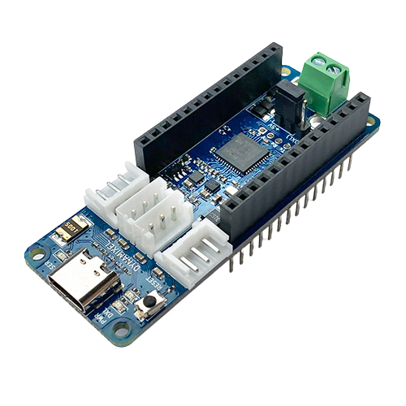

.. _robotis_openrb_150:

Robotis OpenRB-150
########################

Overview
********

The OpenRB-150 is a new open source Arduino compatible embedded controller.
The controller features the same pinout and the form factor as the Arduino MKR to
ensure compatibility with physical accessories, and has support for programming 
using the Arduino IDE. The OpenRB-150 also features 4 dedicated DYNAMIXEL ports,
and supports the DYNAMIXEL Wizard 2.0 testing and calibration software.

Hardware
********

- ATSAMD21G18A ARM Cortex-M0+ processor at 48 MHz
- 32.768 kHz crystal oscillator
- 256 KiB flash memory and 32 KiB of RAM
- Battery connector and charger for 3.7 V lithium polymer batteries
- User LED
- Reset button
- Native USB port
- 4 DYNAMIXEL ports

Supported Features
==================

The robotis_openrb_150 board configuration supports the
following hardware features:

+-----------+------------+------------------------------------------+
| Interface | Controller | Driver/Component                         |
+===========+============+==========================================+
| NVIC      | on-chip    | Nested vector interrupt controller       |
+-----------+------------+------------------------------------------+
| Flash     | on-chip    | Can be used with LittleFS to store files |
+-----------+------------+------------------------------------------+
| SYSTICK   | on-chip    | Systick                                  |
+-----------+------------+------------------------------------------+
| WDT       | on-chip    | Watchdog                                 |
+-----------+------------+------------------------------------------+
| GPIO      | on-chip    | I/O ports                                |
+-----------+------------+------------------------------------------+
| USART     | on-chip    | Serial port                              |
+-----------+------------+------------------------------------------+
| I2C       | on-chip    | Inter-Integrated Circuit                 |
+-----------+------------+------------------------------------------+
| SPI       | on-chip    | Serial Peripheral Interface port         |
+-----------+------------+------------------------------------------+
| USB       | on-chip    | USB device                               |
+-----------+------------+------------------------------------------+

Other hardware features are not currently supported by Zephyr.

The default configuration can be found in the Kconfig file
:zephyr_file:`boards/robotis/openrb_150/robotis_openrb_150_defconfig`.

Connections and IOs
===================

The `Robotis OpenRB-150 e-Manual`_ has detailed
information about the board including `pinouts`_ and the `schematic`_.

System Clock
============

The SAMD21 MCU is configured to use the 32.768 kHz external oscillator
with the on-chip PLL generating the 48 MHz system clock.

Serial Port
===========

The SAMD21 MCU has 6 SERCOM based USARTs. On the Robotis OpenRB-150,
SERCOM5 is the Zephyr console and is available on pins 23 (RX) and 22 (TX).
SERCOM4 is disabled by default and is available on pins 15 (RX) and 14 (TX).
SERCOM2 is the DYNAMIXEL port and is available on pins 13 (RX) and 12 (TX).

I2C Port
========

The SAMD21 MCU has 6 SERCOM based USARTs. On the Robotis OpenRB-150,
SERCOM0 is available on pin 0 (SDA) and pin 1 (SCL).

SPI Port
========

The SAMD21 MCU has 6 SERCOM based SPIs. On the Robotis OpenRB-150,
SERCOM1 is available on pin 16 (MISO), pin 17 (MOSI), and pin 19 (SCK).

USB Device Port
===============

The SAMD21 MCU has a USB device port that can be used to communicate
with a host PC.  See the :ref:`usb-samples` sample applications for
more, such as the :zephyr:code-sample:`usb-cdc-acm` sample which sets up a virtual
serial port that echos characters back to the host PC.

Programming and Debugging
*************************

The Robotis OpenRB-150 ships with a BOSSA compatible SAM-BA bootloader.
The bootloader can be entered by quickly tapping the reset button twice.

Flashing
========

#. Build the Zephyr kernel and the :ref:`hello_world` sample application:

   .. zephyr-app-commands::
      :zephyr-app: samples/hello_world
      :board: robotis_openrb_150
      :goals: build
      :compact:

#. Connect the Robotis OpenRB-150 to your host computer
   using USB

#. Connect a 3.3 V USB to serial adapter to the board and to the
   host.  See the `Serial Port`_ section above for the board's pin
   connections.

#. Run your favorite terminal program to listen for output. Under Linux the
   terminal should be :code:`/dev/ttyACM0`. For example:

   .. code-block:: console

      $ minicom -D /dev/ttyACM0 -o

   The -o option tells minicom not to send the modem initialization
   string. Connection should be configured as follows:

   - Speed: 115200
   - Data: 8 bits
   - Parity: None
   - Stop bits: 1

#. Tap the reset button twice quickly to enter bootloader mode

#. Flash the image:

   .. zephyr-app-commands::
      :zephyr-app: samples/hello_world
      :board: robotis_openrb_150
      :goals: flash
      :compact:

   You should see "Hello World! robotis_openrb_150" in your terminal.

References
**********

.. target-notes::

.. _Robotis OpenRB-150 e-Manual:
    https://emanual.robotis.com/docs/en/parts/controller/openrb-150/

.. _pinouts:
    https://emanual.robotis.com/docs/en/parts/controller/openrb-150/#pinout

.. _schematic:
    https://www.robotis.com/service/download.php?no=2117